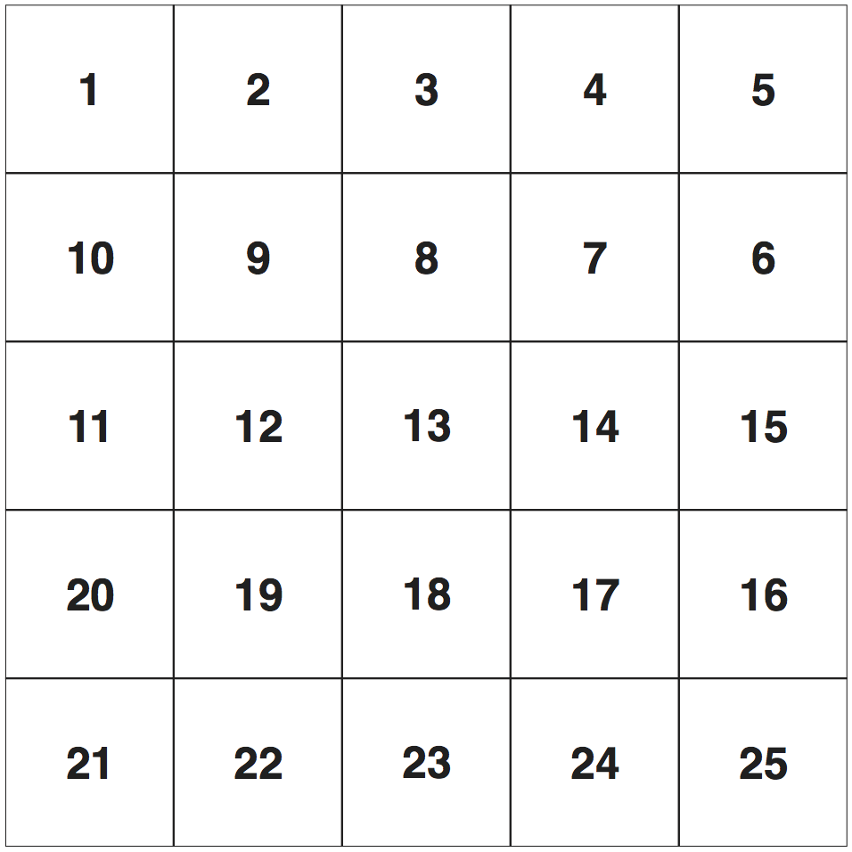
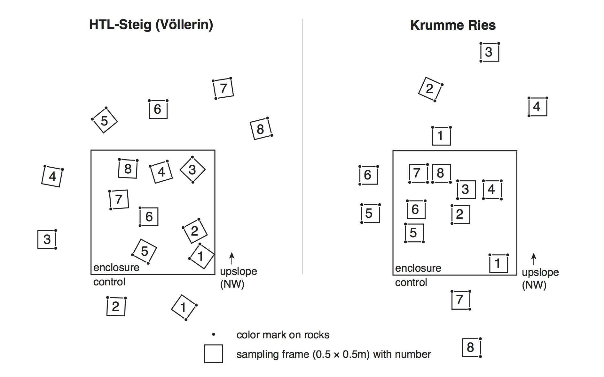

About this data set
===================

**This is a data set from a monitoring study evaluating browsing (grazing) impacts of wild ungulates (*Ibex ibex* and *Rupicaprina rupicaprina*) by using fenced enclosures on two sites.**

Two quadratic enclosures of approximately 2.2m height and 25m² area were erected in spring 2010 using metal poles and wire-mesh fence. Geographic coordinates (WGS-84, EPSG 4326) of site *HTL-Steig* (encoded as `HTL`) is 47.829177 N, 16.047711 E. Study site *Krumme Ries* (encoded as `KRR`) is located at 47.823072 N, 16.039845 E.

Observations of plant cover were made in 0.5 × 0.5m metal frames, dived into 25 cells with polyester strings (see fig. 1). Each cell measures 10 × 10cm. In these frames frequency counts, plant heights and number of flowers were recored. At each site 16 subplots (frames) were sampled (see fig. 2). The surrounding of the enclosures served as control (8 subplots, coded as `k`, `k1 … k8`). The fenced enclosures were used as treatment (8 subplots, coded as `z`, `z1 … z8`).

Furthermore, top-view photographs were made from each quadrat (frame) at every sampling occasion. Pixel coordinates for a set of 20 Control points (inner corners of the sampling frame) where digitized on these raw images. Images where then rectified, cropped and warped to a custom coordinate system of 500 by 500 units (mm) using the GDAL software library (http://www.gdal.org) resulting in exactly quadratic images of 2500 by 2500 pixels (resampled to a common resolution, 2 different camera types). A single pixel measures 0.2 mm.

Description of data files
=========================

File `heights.csv`: (;-separated, UTF-8) contains the measured height in centimeters of the highest plant species in a cell of the frame.

Meaning of columns is as follows:

+ `year`: year of sampling
+ `plot`: unique plot identifier
+ `cell`: cell of sampling frame (25 cells of 10 × 10cm per 0.5 × 0.5m quadrat)
+ `abbr`: abbreviation of the scientific species names (see the [vegsoup-standards](https://github.com/kardinal-eros/vegsoup-standards) repository for details, in particular the `austrian standard list 2008` data set).
+ `height`: plant height

File `sites.csv`: (;-separated, UTF-8) contains descriptive data of sampling frames.

Meaning of columns is as follows:

+ `year`: year of sampling
+ `plot`: unique plot identifier
+ `date`: date of record (ISO-date, yyyy-mm-dd)
+ `cov `: total projected plant cover
+ `scov`: cover of shrub layer
+ `hcov`: cover of herb layer
+ `mcov`: cover of moss layer (including lichens)
+ `rock`: proportion of bare rock surface (sums to 100 with parameters scree and soil)
+ `scree`: proportion of stones and loose gravel  (sums to 100 with parameters rock and soil)
+ `soil`: proportion of bare soil  (sums to 100 with parameters rock and scree)
+ `litter`: cover of plant litetr

File `species.csv`: (;-separated, UTF-8) contains species frequency data of sampling frames.

+ `year`:  year of sampling
+ `plot`: unique plot identifier
+ `layer`: stratum/layer notation
+ `abbr`: abbreviation of the scientific species names (see the [vegsoup-standards](https://github.com/kardinal-eros/vegsoup-standards) repository for details, in particular the `austrian standard list 2008` data set).
+ `freq`: frequency count (1 through 25)
+ `flower`: count of flowers. Value `999`: was used for species with uncountable number of flowers (e.g. *Arenaria serpylifolia*)
+ `comment`: additional comments